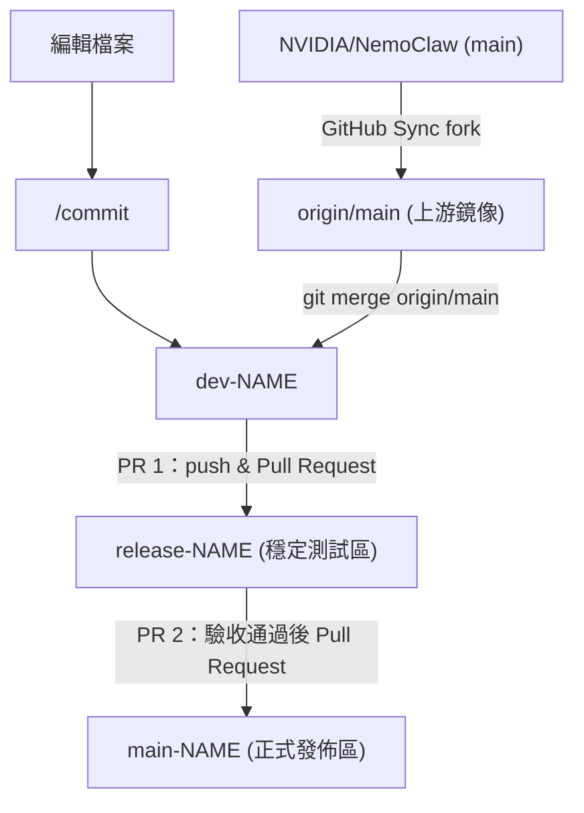

<!-- omit in toc -->
# Nemoclaw

<!-- omit in toc -->
## Table of contents

- [Document](#document)
- [Prerequisite](#prerequisite)
- [General Setup](#general-setup)
- [Developer Setup](#developer-setup)
  - [Contribute](#contribute)
  - [Install](#install)
- [Uninstall](#uninstall)
- [Observe](#observe)
  - [GPU 使用率](#gpu-使用率)
- [Reference](#reference)
- [Appendix](#appendix)
  - [Issue](#issue)

## Document

- [NVIDIA / NemoClaw - README.md](./nvidia-nemoclaw.md)

## Prerequisite

| 項目 | 最低需求 | 建議 |
|------|----------|------|
| CPU | 4 vCPU | 4+ vCPU |
| RAM | 8 GB | 16 GB |
| Disk | 20 GB | 40 GB |
| OS | Ubuntu 22.04 LTS+ | — |
| Container runtime | Docker 或 Podman（Linux）| — |
| OpenShell | 透過安裝腳本取得 | — |
| Node.js | 22.16+ | — |
| npm | 10+ | — |
| uv | 任意版本（Python 依賴管理） | — |
| Python | 3.11+（blueprint 與文件建置用） | — |

## General Setup

執行官方安裝腳本，完成安裝與 onboard：

```bash
curl -fsSL https://www.nvidia.com/nemoclaw.sh | bash
```

- **注意**：若安裝後找不到 `nemoclaw` 指令，執行 `source ~/.bashrc`（zsh 用 `source ~/.zshrc`）或重開終端。

連線到 sandbox：

```bash
nemoclaw my-assistant connect
```

進入 sandbox shell 後，開啟 TUI 與 agent 對話：

```bash
openclaw tui
```

傳送單一訊息並印出回應：

```bash
openclaw agent --agent main --local -m "hello" --session-id test
```

## Developer Setup

### Contribute

本專案 fork 自 `NVIDIA/NemoClaw`，`origin/main` 作為上游鏡像，會不定期透過 GitHub Sync fork 更新。開發完成後經 `release-NAME` 測試驗收，再合併至 `main-NAME`。



- 定期同步上游

  ```bash
  # 1. 至 GitHub 點 Sync fork，更新 origin/main
  # 2. 在 dev-NAME 執行
  git fetch origin
  git merge origin/main
  ```

- 日常開發流程

  ```bash
  # 1. 編輯檔案後 commit
  /commit

  # 2. push 至個人 fork
  git push origin dev-NAME

  # 3. 至 GitHub 建立 PR 1，將 dev-NAME 合併至 release-NAME（測試驗收）

  # 4. 驗收通過後，建立 PR 2，將 release-NAME 合併至 main-NAME
  ```

### Install

- Step 1：安裝 Ollama 與拉取模型

  ```bash
  # 安裝 Ollama
  curl -fsSL https://ollama.com/install.sh | sh

  # 啟動服務（若未自動啟動）
  ollama serve &

  # 拉取 gpt-oss:20b 模型（約 14 GB）
  ollama pull gpt-oss:20b
  ```

  - **記憶體提示**：`gpt-oss:20b` 需要約 16 GB RAM。

  - **GPU Persistence Mode**：啟用後 GPU driver 保持常駐，可減少 inference 冷啟動延遲。若機器專用於跑模型，建議啟用；若需節省閒置資源則停用。

    ```bash
    sudo nvidia-smi -pm 1   # 啟用（推薦用於專用 GPU 機器）
    sudo nvidia-smi -pm 0   # 停用
    ```

- Step 2：安裝 OpenShell

  ```bash
  bash scripts/install-openshell.sh
  ```

  確認安裝成功：

  ```bash
  openshell --version
  ```

  - **OpenShell Lifecycle**：NemoClaw 管理的環境應透過 `nemoclaw onboard` 操作，避免直接呼叫以下指令繞過管理層：

    | 指令 | 用途 | 建議 |
    |------|------|------|
    | `openshell self-update` | 升級 OpenShell 但不更新 nemoclaw 狀態 | ⚠️ 避免，會繞過 nemoclaw 管理 |
    | `npm update -g openshell` | 更新 OpenShell npm 套件但不更新 nemoclaw 狀態 | ⚠️ 避免，會繞過 nemoclaw 管理 |
    | `openshell gateway start --recreate` | 重建 gateway 但不重建 sandbox 狀態 | ⚠️ 避免，會繞過 nemoclaw 管理 |
    | `openshell sandbox create` | 直接建立 sandbox 會與 nemoclaw 狀態不同步 | ⚠️ 避免，會繞過 nemoclaw 管理 |

- Step 3：安裝依賴並讓 CLI 可用

  ```bash
  # 1. 根目錄 npm 依賴（跳過 prepare 腳本避免移除 devDependencies）
  npm install --ignore-scripts

  # 2. 手動 build CLI TypeScript
  npx tsc -p tsconfig.src.json

  # 3. build plugin 子專案
  cd nemoclaw && npm install && npm run build && cd ..

  # 4. blueprint Python 依賴
  cd nemoclaw-blueprint && uv sync && cd ..

  # 5. 讓 nemoclaw 指令全域可用
  npm link
  ```

  確認：

  ```bash
  nemoclaw --version
  ```

- Step 4：執行 onboard

  ```bash
  nemoclaw onboard
  ```

  引導過程中選擇 inference provider 時：

  | 項目 | 填入值 |
  |------|--------|
  | Provider | Ollama (local) |
  | URL | `http://localhost:11434` |
  | Model | `gpt-oss:20b` |

- Step 5：連線到 sandbox

  ```bash
  nemoclaw my-assistant connect
  ```

  進入 sandbox shell 後，開啟 TUI 與 agent 對話：

  ```bash
  openclaw tui
  ```

## Uninstall

執行專案內建的 uninstall 腳本，移除 NemoClaw 建立的所有 host 端資源：

```bash
nemoclaw uninstall
```

腳本預設會保留 Docker、Node.js、npm 與 Ollama，僅清除以下項目：

- 所有 OpenShell sandboxes、gateway 與 NemoClaw providers
- 相關 Docker containers、images 與 volumes
- `~/.nemoclaw`、`~/.config/openshell`、`~/.config/nemoclaw` 狀態目錄
- 全域 `nemoclaw` npm 套件
- OpenShell binary（預設移除；若要保留請加 `--keep-openshell`）

可用選項：

| 選項 | 說明 |
|------|------|
| `--yes` | 略過確認提示，直接執行 |
| `--keep-openshell` | 保留 `openshell` binary，不移除 |
| `--delete-models` | 一併刪除 NemoClaw 拉取的 Ollama 模型 |

## Observe

### GPU 使用率

```bash
watch -n 1 nvidia-smi
```

## Reference

- GitHub
  - [openclaw / openclaw](https://github.com/openclaw/openclaw)
  - [NVIDIA / NemoClaw](https://github.com/NVIDIA/NemoClaw)
  - [NVIDIA / OpenShell](https://github.com/NVIDIA/OpenShell)
- Ollama Models
  - [gpt-oss](https://ollama.com/library/gpt-oss)
  - [qwen3.5](https://ollama.com/library/qwen3.5)

## Appendix

### Issue

- `nemoclaw onboard` 因 OpenShell 版本檢查失敗而中止
  - **上游 Issue**：[#1612](https://github.com/NVIDIA/NemoClaw/issues/1612)（Open，2026-04-09 開出，尚無修復 PR）
  - **原因**：[PR #1564](https://github.com/NVIDIA/NemoClaw/pull/1564)（commit `0dc3334`，2026-04-08）在 `preflight()` 加入了 `min_openshell_version` enforce，但 `blueprint.yaml` 宣告 `min_openshell_version: "0.1.0"` 而 OpenShell 最新 release 僅 `0.0.25`
  - **Workaround**：將 `nemoclaw-blueprint/blueprint.yaml` 的 `min_openshell_version` 從 `"0.1.0"` 改為 `"0.0.24"`
