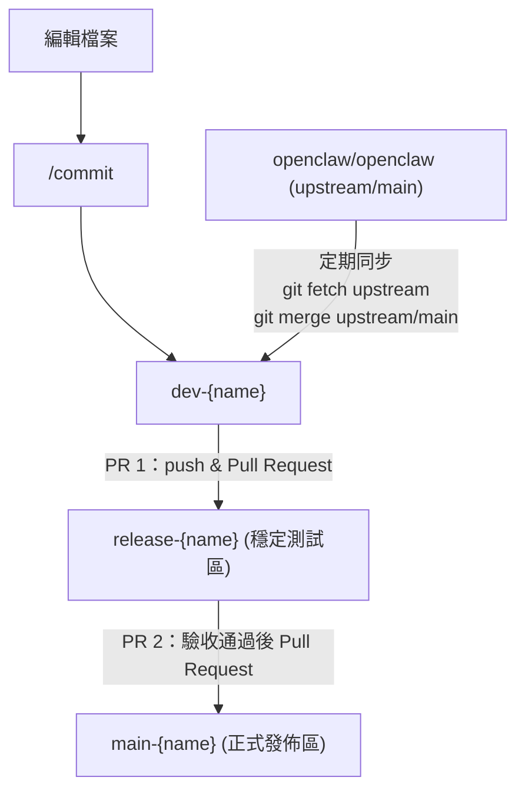

<!-- omit in toc -->
# Nemoclaw

<!-- omit in toc -->
## Table of contents

- [Document](#document)
- [Contribute](#contribute)
  - [初次設定 upstream（僅需一次）](#初次設定-upstream僅需一次)
  - [定期同步上游](#定期同步上游)
  - [日常開發流程](#日常開發流程)
- [Reference](#reference)

## Document

- [NVIDIA / NemoClaw - README.md](./nvidia-nemoclaw.md)

## Contribute

本專案 fork 自 `openclaw/openclaw`，會不定期將上游 `main` merge 進 `dev-{name}`，開發完成後經 `release-{name}` 測試驗收，再合併至 `main-{name}`。



### 初次設定 upstream（僅需一次）

```bash
git remote add upstream https://github.com/openclaw/openclaw.git
```

### 定期同步上游

```bash
git fetch upstream
git merge upstream/main
```

### 日常開發流程

```bash
# 1. 編輯檔案後 commit
/commit

# 2. push 至個人 fork
git push origin dev-<name>

# 3. 至 GitHub 建立 PR 1，將 dev-<name> 合併至 release-<name>（測試驗收）

# 4. 驗收通過後，建立 PR 2，將 release-<name> 合併至 main-<name>
```

## Reference

- GitHub
  - [NVIDIA / NemoClaw](https://github.com/NVIDIA/NemoClaw)
  - [openclaw / openclaw](https://github.com/openclaw/openclaw)
