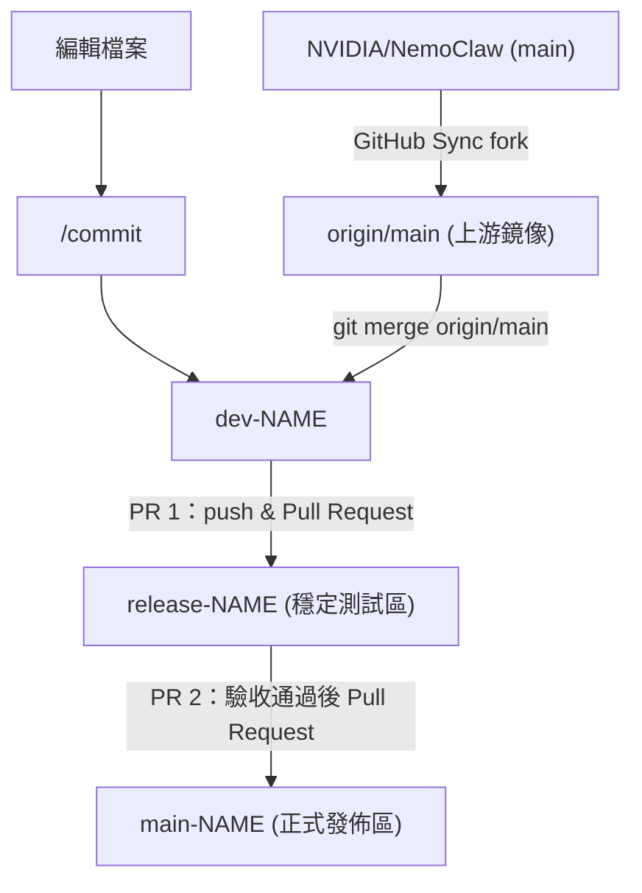

<!-- omit in toc -->
# Nemoclaw

<!-- omit in toc -->
## Table of contents

- [Document](#document)
- [Contribute](#contribute)
  - [定期同步上游](#定期同步上游)
  - [日常開發流程](#日常開發流程)
- [Reference](#reference)

## Document

- [NVIDIA / NemoClaw - README.md](./nvidia-nemoclaw.md)

## Contribute

本專案 fork 自 `NVIDIA/NemoClaw`，`origin/main` 作為上游鏡像，會不定期透過 GitHub Sync fork 更新。開發完成後經 `release-NAME` 測試驗收，再合併至 `main-NAME`。



### 定期同步上游

```bash
# 1. 至 GitHub 點 Sync fork，更新 origin/main
# 2. 在 dev-NAME 執行
git fetch origin
git merge origin/main
```

### 日常開發流程

```bash
# 1. 編輯檔案後 commit
/commit

# 2. push 至個人 fork
git push origin dev-NAME

# 3. 至 GitHub 建立 PR 1，將 dev-NAME 合併至 release-NAME（測試驗收）

# 4. 驗收通過後，建立 PR 2，將 release-NAME 合併至 main-NAME
```

## Reference

- GitHub
  - [NVIDIA / NemoClaw](https://github.com/NVIDIA/NemoClaw)
  - [openclaw / openclaw](https://github.com/openclaw/openclaw)
