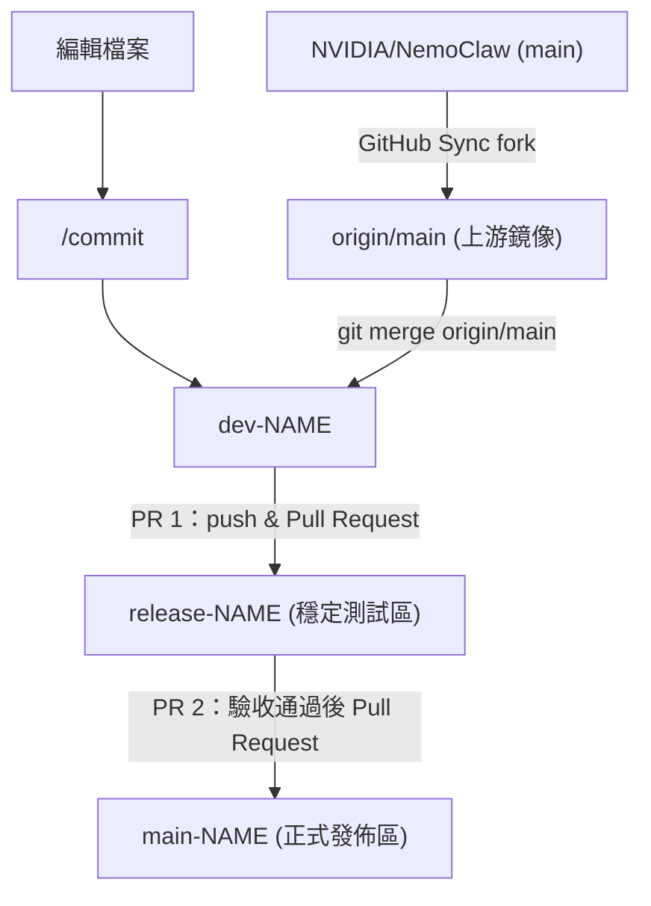

<!-- omit in toc -->
# Nemoclaw

<!-- omit in toc -->
## Table of contents

- [Document](#document)
- [Contribute](#contribute)
  - [定期同步上游](#定期同步上游)
  - [日常開發流程](#日常開發流程)
- [Prerequisite](#prerequisite)
  - [開發環境（跑測試 / lint / build）](#開發環境跑測試--lint--build)
  - [執行 App（啟動 OpenClaw agent sandbox）](#執行-app啟動-openclaw-agent-sandbox)
- [Reference](#reference)

## Document

- [NVIDIA / NemoClaw - README.md](./nvidia-nemoclaw.md)

## Contribute

本專案 fork 自 `NVIDIA/NemoClaw`，`origin/main` 作為上游鏡像，會不定期透過 GitHub Sync fork 更新。開發完成後經 `release-NAME` 測試驗收，再合併至 `main-NAME`。



### 定期同步上游

```bash
# 1. 至 GitHub 點 Sync fork，更新 origin/main
# 2. 在 dev-NAME 執行
git fetch origin
git merge origin/main
```

### 日常開發流程

```bash
# 1. 編輯檔案後 commit
/commit

# 2. push 至個人 fork
git push origin dev-NAME

# 3. 至 GitHub 建立 PR 1，將 dev-NAME 合併至 release-NAME（測試驗收）

# 4. 驗收通過後，建立 PR 2，將 release-NAME 合併至 main-NAME
```

## Prerequisite

### 開發環境（跑測試 / lint / build）

| 項目 | 最低版本 |
|------|----------|
| Node.js | 22.16+ |
| npm | 10+ |
| Docker | 任意支援版本，需正在運行 |
| uv | 任意版本（Python 依賴管理） |
| Python | 3.11+（blueprint 與文件建置用） |

```bash
npm install
cd nemoclaw && npm install && npm run build && cd ..
cd nemoclaw-blueprint && uv sync && cd ..
```

### 執行 App（啟動 OpenClaw agent sandbox）

除上述開發環境外，還需要：

| 項目 | 說明 |
|------|------|
| OpenShell | NVIDIA agent runtime，透過安裝腳本取得 |
| CPU / RAM / Disk | 最低 4 vCPU / 8 GB RAM / 20 GB 磁碟空間 |
| Container runtime | Linux 上使用 Docker 或 Podman |

```bash
# 安裝後透過 onboard 引導建立 sandbox
node bin/nemoclaw.js onboard
```

## Reference

- GitHub
  - [NVIDIA / NemoClaw](https://github.com/NVIDIA/NemoClaw)
  - [openclaw / openclaw](https://github.com/openclaw/openclaw)
